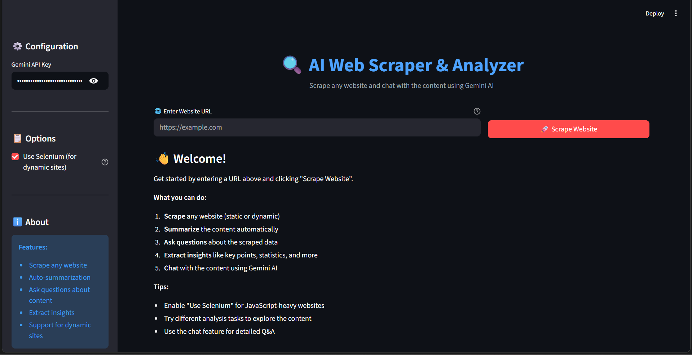
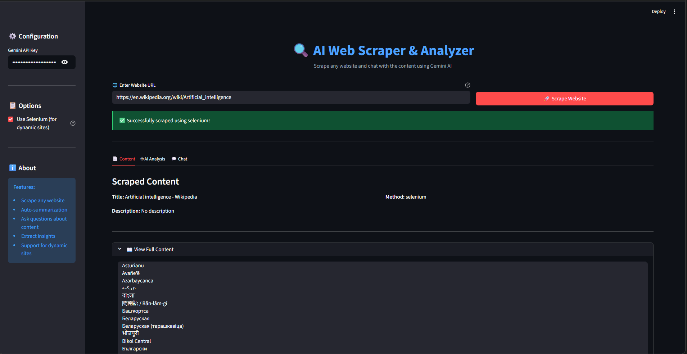
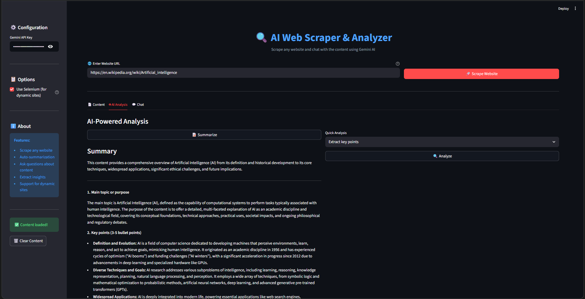

# AI Web Scraper & Analyzer

An AI-powered web scraping platform that extracts website content, enables AI-driven analysis, provides grounded answers with hyperlinks using RAG, and supports historical website analysis using Web Archives.

---

## Features

* Static & dynamic website scraping
* Selenium-based rendering for JavaScript-heavy websites
* AI-powered summarization and contextual Q&A
* RAG pipeline with source hyperlinks
* Historical website comparison using Web Archives
* Interactive Streamlit dashboard

---

## Tech Stack

* Python
* Streamlit
* BeautifulSoup
* Selenium
* Requests
* RAG (Retrieval Augmented Generation)
* Wayback Machine API
* LLM Integration (Gemini / OpenAI / Groq)

---

## How to Run

Clone the repository

git clone https://github.com/Aditya-7117/ai-web-scraper.git

Move into the project folder

cd ai-web-scraper

Create virtual environment

python -m venv venv

Activate virtual environment

Windows
venv\Scripts\activate

Install dependencies

pip install -r requirements.txt

Run the application

streamlit run app.py

The application will start at

http://localhost:8501

---

## Architecture Flow

1. User provides a website URL
2. Website content is scraped using Requests or Selenium
3. Content is cleaned and parsed using BeautifulSoup
4. RAG pipeline retrieves relevant context and hyperlinks
5. LLM performs summarization and contextual Q&A
6. Optional historical analysis compares past snapshots using Web Archives
7. Results are displayed through the Streamlit interface

---

## Screenshots

### Home

### Scraped Content

### AI Summary

---

## Security

* No API keys are stored inside the repository
* Users provide their own LLM API keys during runtime

---

## Example Use Cases

* Market research
* Competitor website monitoring
* Product trend analysis using Web Archives
* Grounded AI insights with source links

---

## Future Improvements

* Distributed scraping engine
* Scheduled scraping jobs
* Vector database integration for large-scale RAG
* Production deployment
